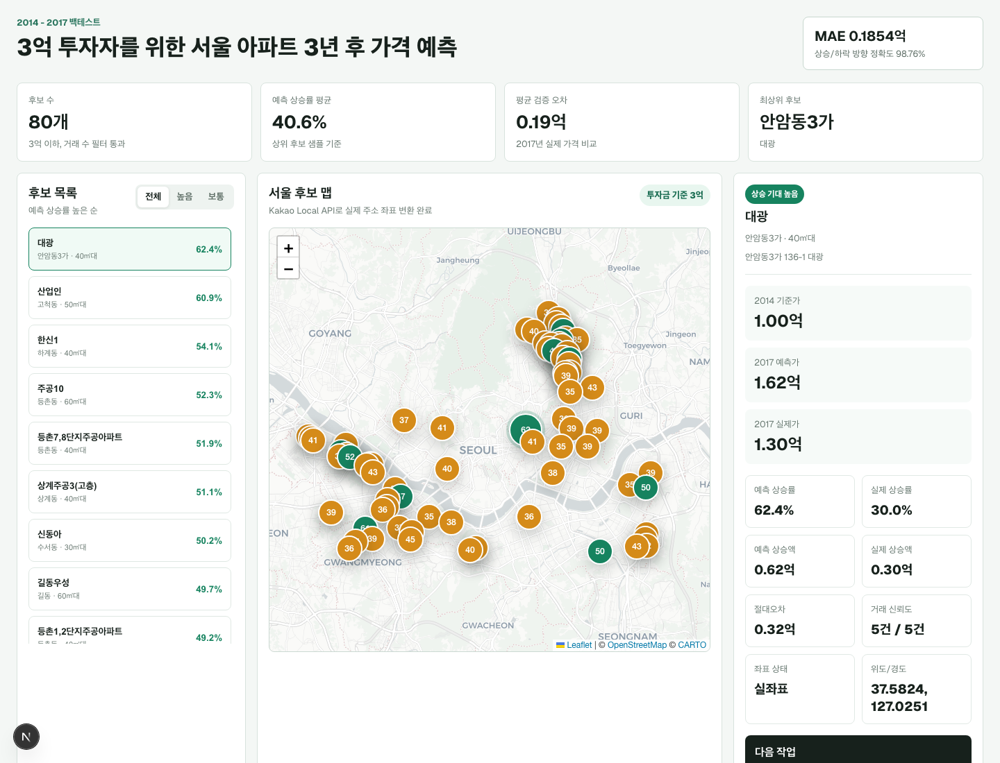

# Seoul Apartment Price Map

3억 투자금을 가진 초보 부동산 투자자를 위한 서울 아파트 3년 후 가격 예측 지도 프로토타입입니다.

머신러닝 실습에서 만든 예측 결과를 Next.js 화면으로 옮기고, Kakao Local API로 변환한 실제 좌표를 Leaflet 지도 위에 표시했습니다.

## Live Demo

https://nextjs-map-prototype.vercel.app

## Preview



## Features

- 3억 이하 투자 후보 목록
- 예측 상승률 높은 순 정렬
- 전체/상승 기대 높음/보통 필터
- Leaflet 기반 실제 지도
- Kakao Local API로 변환한 주소 좌표
- 후보 클릭 시 상세 패널 갱신
- 2014 기준가, 2017 예측가, 2017 실제가 비교
- 예측 상승률, 실제 상승률, 절대오차, 거래 신뢰도 표시

## Tech Stack

- Next.js 16
- React 19
- TypeScript
- Leaflet
- React Leaflet
- Kakao Local API
- Vercel

## Data Flow

```text
Jupyter Notebook
→ 서울 아파트 데이터 정리
→ 3년 후 가격 예측 모델
→ 지도 후보 CSV 생성
→ Kakao Local API geocoding
→ src/data/candidates.json
→ Next.js + Leaflet 지도 렌더링
```

## Data Source

앱에서 직접 사용하는 데이터:

```text
src/data/candidates.json
```

생성 원본:

```text
../data/processed/map_export_predicted_top_growth_2014_2017.csv
```

현재 데이터는 2014년 기준 3억 이하 후보의 2017년 예측/실제 가격 비교 결과를 포함합니다.

## Run Locally

```bash
npm install
npm run dev
```

Open:

```text
http://localhost:3000
```

## Build

```bash
npm run build
```

## Geocoding

Kakao Developers에서 REST API 키를 발급받은 뒤 아래 명령을 실행합니다.

```bash
KAKAO_REST_API_KEY=your_key npm run geocode:kakao
```

성공하면 `src/data/candidates.json`의 각 후보에 다음 값이 추가됩니다.

- `lat`
- `lng`
- `resolvedAddress`

## Deployment

현재 Vercel에 프로덕션 배포되어 있습니다.

```text
https://nextjs-map-prototype.vercel.app
```

## Caveat

이 앱은 실제 투자 추천 서비스가 아니라 교육용/포트폴리오용 데이터 분석 프로토타입입니다.

예측 결과는 과거 데이터 기반의 실습 결과이며, 실제 투자 판단에는 사용할 수 없습니다.
